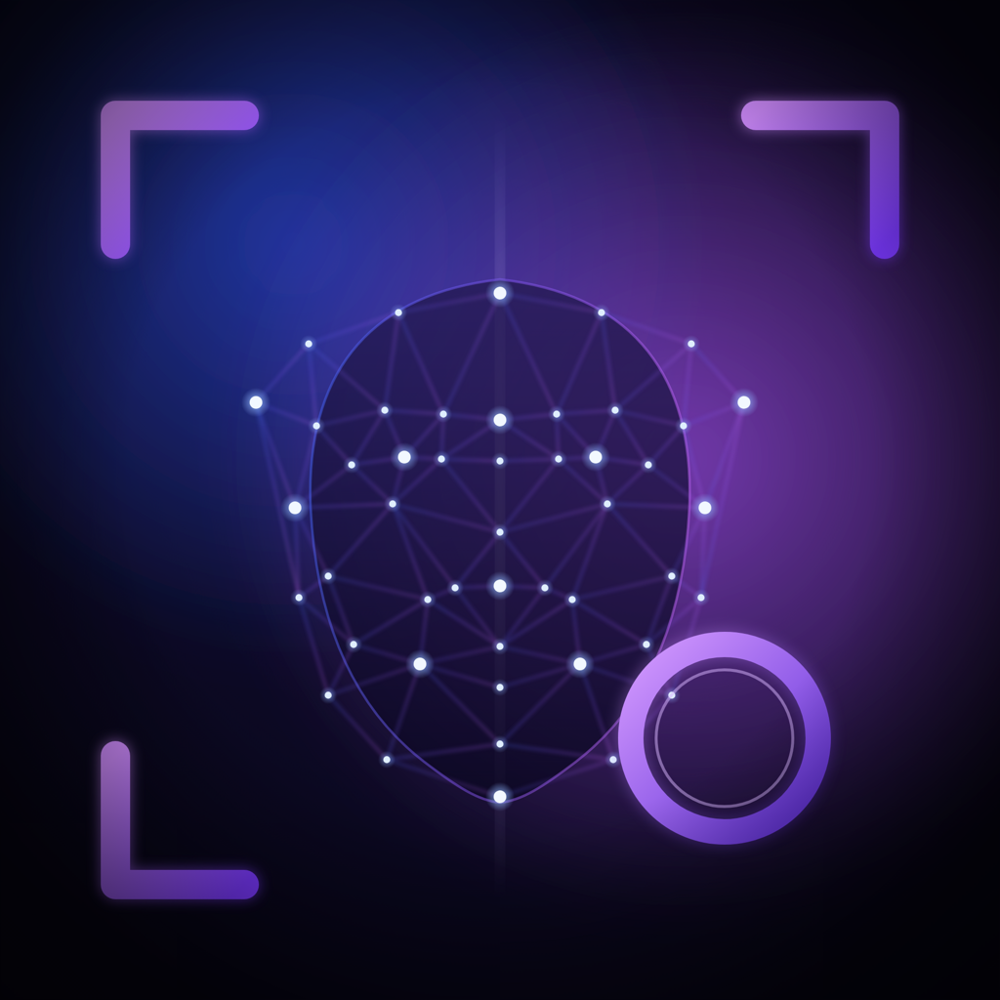
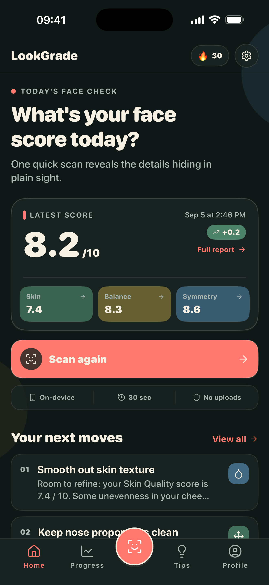
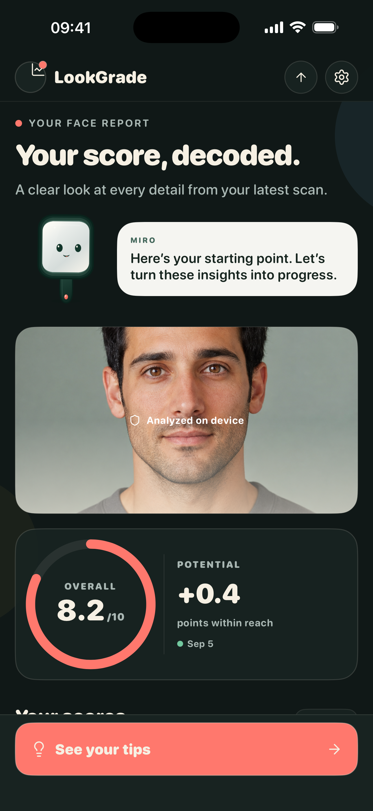
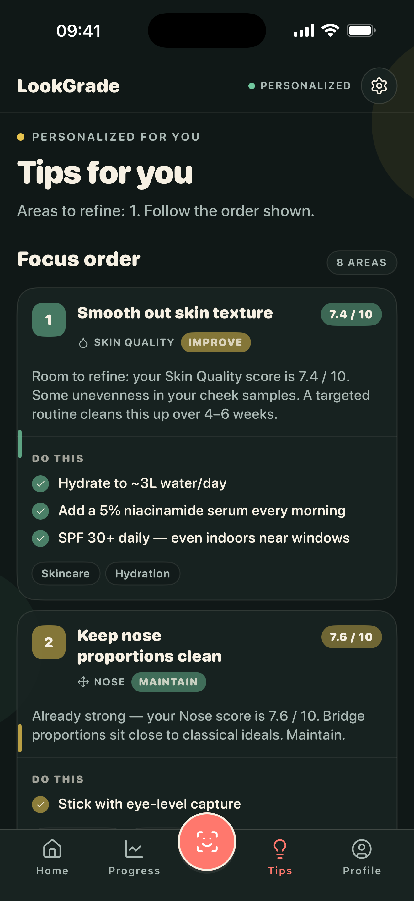
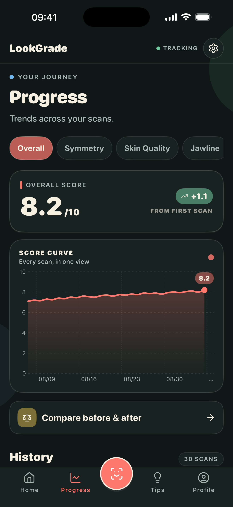

<div align="center">
  
  <h1>LookGrade</h1>
  <p><strong>On-device face analysis. Native iOS engineering.</strong></p>
  <p>A SwiftUI app that turns a photo into a facial-landmark report, self-care suggestions, and a local scan history.</p>
  <p>
    <a href="https://apps.apple.com/app/lookgrade/id6789945408">Download on the App Store</a> ·
    <a href="docs/ARCHITECTURE.md">Architecture</a> ·
    <a href="docs/VISION-PIPELINE.md">Vision pipeline</a> ·
    <a href="docs/SETUP.md">Run locally</a>
  </p>
  <a href="https://github.com/numann44/LookGrade/actions/workflows/ci.yml"></a>
</div>

## The product

LookGrade combines camera capture, local image processing, a report with eight categories, personalized tips, and progress comparisons in one iPhone/iPad application. It requires no user account. The interface supports **11 languages**, including Arabic with right-to-left layout, and uses a Rive character named **Miro** to guide onboarding.

The engineering goal is to keep the photo-analysis path on the device while integrating the surrounding product requirements: subscription access, capture quality checks, cancellation, persistent history, localization, and optional product analytics.

**What the analysis means:** Apple Vision detects facial landmarks. Hand-written Swift heuristics turn geometry and sampled image statistics into scores. This repository does not contain a custom-trained attractiveness model, a clinical validation study, or an objective measure of appearance. Scores are for personal tracking and entertainment; lighting, pose, and camera conditions affect them.

## Inside the app

<table>
  <tr>
    <td></td>
    <td></td>
    <td></td>
    <td></td>
  </tr>
  <tr><td align="center">Home</td><td align="center">Report</td><td align="center">Tips</td><td align="center">Progress</td></tr>
</table>

These are real SwiftUI screens from the supplied September 5, 2026 simulator capture set. The portrait is a fictional adult; scores and history are seeded examples, not measured outcomes or evidence of improvement. The capture copy included presentation-only adjustments. [Screenshot provenance and reproduction](docs/SCREENSHOTS.md) explains the exact boundaries.

## Engineering highlights

| Problem | Implementation | Start reading |
| --- | --- | --- |
| Portrait JPEGs can have rotated sensor buffers | Normalize EXIF orientation before landmark detection | [VisionAnalysisService](FaceRate/Features/Analysis/VisionAnalysisService.swift) |
| Vision and UI/image math use different coordinate systems | Convert normalized, face-relative points into top-left image pixels | [Vision adapter](FaceRate/Features/Analysis/FaceMetrics+Vision.swift) |
| Image-dependent math is difficult to test | Separate Vision extraction, `FaceMetrics`, pixel sampling, and pure scoring functions | [FaceScorer](FaceRate/Features/Analysis/FaceScorer.swift), [tests](FaceRateTests/FaceScorerTests.swift) |
| Users can leave while a scan is running | Coordinate analysis state and check cancellation before publishing results | [ScanCoordinator](FaceRate/Features/Analysis/ScanCoordinator.swift) |
| An app update can move the data container | Resolve owned capture filenames in the current container and fall back to saved thumbnails | [ScanImageStore](FaceRate/Features/Analysis/ScanImageStore.swift) |
| Deleting visible history should not reset scan usage | Keep a small rolling quota ledger in Keychain, separate from history | [ScanHistoryStore](FaceRate/Features/Analysis/ScanHistoryStore.swift) |
| Optional analytics must not contain the scan itself | Consent gating, a property allowlist, and an injectable offline test sink | [AppAnalytics](FaceRate/App/AppAnalytics.swift) |
| Existing users must survive a rewrite | Migrate legacy Flutter preferences while retaining product and bundle identifiers | [LegacyDataMigrator](FaceRate/App/LegacyDataMigrator.swift) |

## How a scan becomes a report

```mermaid
flowchart LR
    A[Camera or photo library] --> B[Normalize image orientation]
    B --> C[Apple Vision landmarks]
    C --> D[Pixel-space FaceMetrics]
    D --> E[Cheek-region image statistics]
    E --> F[Capture-quality checks]
    F --> G[Eight heuristic category scores]
    G --> H[Findings and face-profile descriptors]
    H --> I[SwiftUI report]
    I --> J[Local history and thumbnails]
```



The categories are symmetry, skin quality, jawline, eyes, lips, nose, tone, and harmony. The scorer maps each heuristic quality value into **5.5–9.5**, then computes a weighted overall score. These are product-design choices, not learned confidence probabilities. [The pipeline guide](docs/VISION-PIPELINE.md) documents formulas, thresholds, fallbacks, and limitations.

## Technology

| Layer | Choice |
| --- | --- |
| Application | Swift, SwiftUI, Observation; iOS/iPadOS 17+ |
| Capture and analysis | AVFoundation, PhotosUI, Apple Vision, CoreGraphics |
| State | `@Observable` models composed at app startup; main-actor routing and coordination |
| Persistence | Codable/JSON in UserDefaults, protected local JPEG files, Keychain quota records |
| Subscriptions | RevenueCat 5.80.3; Test Store in Debug, App Store configuration in Release |
| Character animation | Rive 6.25.1 |
| Optional analytics | Mixpanel 5.2.0, explicit consent and filtered interaction metadata |
| Verification | XCTest, a separate XCUITest journey harness, localization validation, GitHub Actions |

Dependency versions are recorded in the shared [Package.resolved](FaceRate.xcodeproj/project.xcworkspace/xcshareddata/swiftpm/Package.resolved).

## Run locally

```sh
git clone https://github.com/numann44/LookGrade.git
cd LookGrade
open FaceRate.xcodeproj
```

Select the **FaceRate** scheme and an iOS 17+ simulator. Let Xcode resolve Swift packages, then run. `FaceRate` is the historical module/project name; the displayed product is **LookGrade**. Keeping the existing bundle ID and storage keys preserves the upgrade path. There is no root XcodeGen specification to regenerate.

For a Debug-only screen preview, add `PREVIEW_SCREEN=home` to the scheme's Run environment. Available screens include `home`, `report`, `tips`, `progress`, `profile`, and `onboarding`. Use a disposable simulator: preview mode clears and seeds its local history and grants local test access. It does not run a real scan or prove purchase access. Full setup and SDK configuration are in [SETUP.md](docs/SETUP.md).

## Repository map

```text
FaceRate/
  App/                    Composition, routing, migration, analytics, SDK configuration
  Features/
    Capture/              Camera session, gallery input, scan flow
    Analysis/             Vision adapter, scoring, findings, history and image stores
    Entitlements/         Subscription state, paywall, preferences, reminders
    Onboarding/           Guided first-run experience
    Home/ Progress/       Overview, charts and scan comparisons
    Tips/ Profile/        Suggestions, settings and data controls
  DesignSystem/           Color, typography, radius and surface tokens
  Shared/                 Reusable SwiftUI components and Miro integration
  Resources/              11 localization bundles, privacy manifest and Rive asset
FaceRateTests/            Unit and regression tests
FaceRate.xcodeproj/       Maintained Xcode project and locked Swift packages
Analytics/               Event dictionary and separate UI-test harness
LegalSite/               Privacy, terms and support page source
scripts/                 Repeatable checks and release-journey runner
docs/                    Architecture, pipeline, setup, verification and screenshots
```

## Verification

```sh
python3 scripts/check_localizations.py
bash scripts/test.sh
```

GitHub Actions validates the localization catalogs, runs the unit tests on an isolated simulator, builds an unsigned Release target, and preserves XCTest results. Local verification and known gaps are recorded in [DEVELOPMENT.md](docs/DEVELOPMENT.md).

The test suite covers scoring behavior, malformed/legacy history, rolling quotas, result persistence, update-safe photo paths, localization, dialogue state, and analytics consent/filtering. It does not establish model accuracy, fairness, medical validity, or App Store purchase approval.

## Privacy and product boundaries

The face-analysis pipeline is local. RevenueCat handles subscription state; optional Mixpanel analytics handles allowlisted interaction events after consent. Photos, face measurements, scores, names, and answer text are not included in those app analytics payloads. A user can explicitly share a report. [Data boundaries](docs/PRIVACY.md) distinguish capture files, persistent thumbnails, quota records, analytics, and deletion.

This source snapshot is version **1.5 (8)** and may differ from the currently distributed App Store build. Publishing this repository does not submit a store update or change store metadata.

## Further reading

- [Architecture and engineering decisions](docs/ARCHITECTURE.md)
- [Vision and scoring pipeline](docs/VISION-PIPELINE.md)
- [Setup and configuration](docs/SETUP.md)
- [Tests, CI, and verification boundaries](docs/DEVELOPMENT.md)
- [Design system](DESIGN.md)
- [Screenshots and provenance](docs/SCREENSHOTS.md)
- [Contributing](CONTRIBUTING.md)

## Ownership

Maintained by [Ahmet Numan Şahin](https://github.com/numann44). This repository is published for technical and portfolio review. No open-source license is granted; source, branding, and artwork remain with their respective owners. Third-party packages retain their own licenses.
