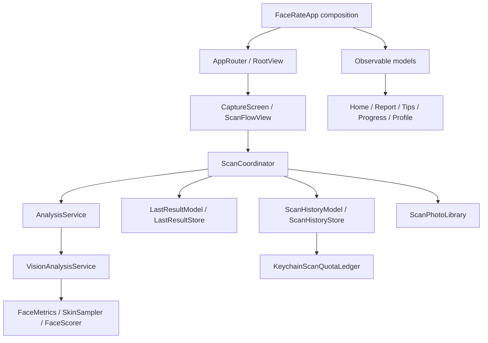

# Architecture

LookGrade is a native SwiftUI application with feature-based source organization. The maintained Xcode target and module are still named `FaceRate`; the product is displayed as LookGrade. The identifiers are retained to preserve installed users' subscriptions, local records, and migration behavior.

## Composition and state

[`FaceRateApp`](../FaceRate/FaceRateApp.swift) performs legacy migration, configures the subscription SDK, creates the observable models, and injects them through SwiftUI's environment. Startup order matters: stores must read the migrated preferences, and subscription state must use the configured SDK.

| Component | Responsibility |
| --- | --- |
| `AppPrefsModel` | Onboarding answers, preferences, reminder settings |
| `EntitlementsModel` | Subscription access and recovery state |
| `ScanHistoryModel` | Observable history, rolling quota, streak calculation |
| `LastResultModel` | Latest complete report, restored on launch |
| `AppRouter` | Selected tab and access-aware navigation |
| `ScanCoordinator` | Analysis state, cancellation, result publication, history promotion |

The observable models use Observation. Routing and coordination are main-actor isolated. Image analysis is exposed through an async `AnalysisService` interface, and skin sampling uses a detached task. This separation permits scorer tests without Vision or a camera; it is not a claim of a fully isolated or modularized application.

## Scan lifecycle

1. Camera capture or gallery selection produces a `ScanInput`, containing an image path, timestamp, and source.
2. `ScanCoordinator.run` enters the analyzing state and invokes the injected service.
3. Vision extracts the largest face. Orientation, coordinates, pixel sampling, quality checks, and scoring are described in [VISION-PIPELINE.md](VISION-PIPELINE.md).
4. The coordinator checks cancellation before updating the latest result and optionally recording history.
5. Subscriber scans are saved immediately. The onboarding preview is kept as the latest result without consuming paid history/quota.
6. After subscription access is confirmed, `recordResultInHistory` promotes the onboarding result. Its timestamp-derived ID guard prevents the same result from being inserted twice.

Failures are surfaced as an actionable message. Cancellation prevents a completed background task from navigating to a report the user has already left. The current coordinator has `idle`, `analyzing`, and `failed` states; there is no persistent job queue or remote analysis worker.

## Local persistence

| Store | Contents | Design choice |
| --- | --- | --- |
| UserDefaults preferences | Onboarding and settings | Small, versioned records; legacy Flutter keys migrate once |
| `LastResultStore` | Most recent complete `ScanResult` | Codable persistence for restoring Home and Tips |
| `ScanHistoryStore` | Up to 200 summary entries | JSON array, newest first; undecodable entries survive subsequent writes |
| `ScanImageStore` | Latest full-resolution JPEG | Controlled cache directory; previous capture is replaced |
| `ScanPhotoLibrary` | Per-scan JPEG thumbnail, maximum dimension 480 px | Application Support storage for comparisons |
| Keychain quota ledger | Scan IDs and timestamps | Independent of visible history; 48-hour retention around a 24-hour allowance |

The history writer operates on the raw JSON array rather than decoding and re-encoding everything. Otherwise a record from an older or newer schema could silently disappear when adding a new scan. Tests exercise that preservation behavior.

An iOS update may relocate the app container. `ScanImageStore.currentPath` recognizes only the application's UUID-named capture files and maps them into the current cache directory. Reports can also use the separately saved thumbnail. Arbitrary paths are not rewritten.

## Subscription boundary

RevenueCat supplies offerings, localized package prices, purchase/restore results, and the `pro` entitlement. Debug defaults to Test Store; Release selects the App Store SDK key. Access is refreshed through the entitlement model. The app also keeps recovery-related state in Keychain.

Every paid plan shares five analyses in a rolling 24-hour window. Visible history deletion does not erase the separate quota ledger. This is local usage protection, not a server-enforced guarantee against device-clock manipulation, reinstall behavior, or cross-device abuse.

The paywall is implemented in SwiftUI, with a one-time exit-offer flow. A successful UI test with Test Store cannot establish the state of Apple's live products or receipts.

## Analytics boundary

`AppAnalytics` is an app-level service with an injectable sink for offline tests. Collection requires optional consent. Properties pass through an allowlist before SDK delivery; unknown/denied consent sends nothing, and previously declined activity is not replayed.

Debug does not configure the analytics SDK unless explicitly launched with `LOOKGRADE_ANALYTICS_QA=1`. Release collection still requires consent. [PRIVACY.md](PRIVACY.md) and the [event dictionary](../Analytics/README.md) document the data boundaries.

## Tradeoffs and next engineering work

- Feature folders are easy to navigate, but several screens and the paywall remain large. Extract responsibilities when changing their behavior rather than introducing empty abstraction layers.
- UserDefaults is appropriate for a small bounded history. A richer searchable dataset would justify a transactional store and an explicit schema migration strategy.
- The pure scorer is testable and readable. Its constants are product heuristics; meaningful accuracy work would need a defined task, representative evaluation data, and measured capture-condition sensitivity.
- Swift 5 language mode currently permits an AVFoundation non-Sendable capture warning. A Swift 6 strict-concurrency migration requires a review of session ownership and queue confinement; suppressing that warning is not a completed migration.
