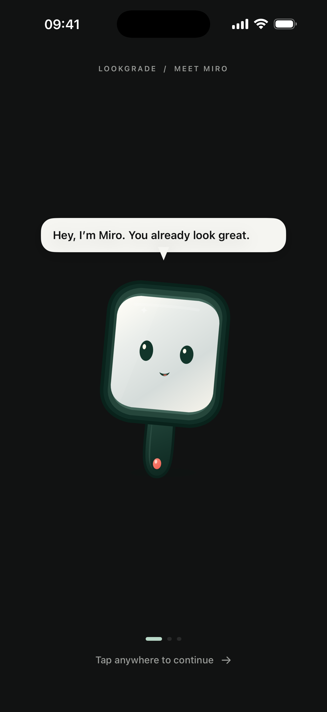
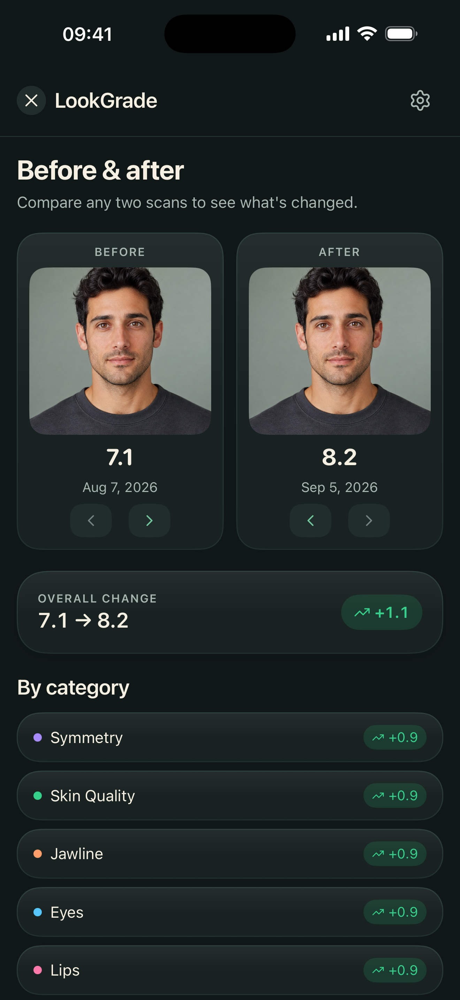

# Screenshots and provenance

## Included images

The repository includes six English screen captures from the supplied **September 5, 2026** LookGrade capture package. They were taken from the native SwiftUI app in an iPhone 17 Pro Max simulator. The source app snapshot published here is newer; these files are documentation assets from that capture session, not freshly recaptured October screens.

| Image | Screen | Demonstration content |
| --- | --- | --- |
| [Home](images/home.png) | Latest result and next steps | Seeded score and history |
| [Report](images/report.png) | Portrait, Miro, overall score | Synthetic adult portrait and seeded values |
| [Tips](images/tips.png) | Prioritized suggestions | Suggestions derived from seeded categories |
| [Progress](images/progress.png) | Trend chart and history | 30 synthetic records |
| [Onboarding](images/onboarding.png) | Meet Miro | Native onboarding component |
| [Comparison](images/comparison.png) | Two selected scans | Same synthetic portrait with different sample scores |

The original source filenames and SHA-256 checksums are in [images/manifest.json](images/manifest.json). The images are copied without redrawing or generating an application interface.

<table>
  <tr>
    <td></td>
    <td></td>
  </tr>
  <tr><td align="center">Onboarding</td><td align="center">Comparison</td></tr>
</table>

## How the supplied capture set was made

The original capture workflow built a separate copy of the app with screenshot-specific seed data and controls. It used Alex as a fictional profile, a seeded score series, and an ImageGen-created fictional adult portrait. The portrait was supplied as camera demonstration input because Simulator has no physical camera. The app's Rive character and SwiftUI components rendered the interface.

The capture copy also bounded the analysis photo to its canvas and capped iPad content width at 600 points. It froze an intermediate analysis state and scrolled report/history screens for specific compositions. Those presentation changes were confined to that capture copy. The original capture-specific project is not included as a second app source tree in this repository.

The portrait's prompt and provenance are in [the fixture record](../Analytics/UITests/Fixtures/PROVENANCE.md). The photo is an artificial demonstration asset. Neither it nor the seeded chart establishes a measured change in a person's appearance.

## Reproduce current UI previews

1. Build the maintained project in Debug on a dedicated simulator.
2. Add `PREVIEW_SCREEN` to the Xcode Run environment, selecting `home`, `report`, `tips`, `progress`, `profile`, or `onboarding`.
3. Set the simulator's language to English for a matching documentation locale.
4. Run and capture the screen using Simulator's screenshot command.
5. Inspect clipping, typography, local data, and the selected locale before adding an image to the repository.

The built-in preview seeds five records and uses `MockScanData`. It does not include the marketing portrait or recreate the 30-record September dataset. Exact byte-for-byte reproduction of those original images requires the original capture copy and its controls. New images should have their own capture date and provenance rather than being labeled as reproductions of the old dataset.

For screenshots of an actual first-run journey, use the separate XCUITest harness; its attachments are evidence of the test flow rather than marketing renders. For actual Vision outputs, import the synthetic fixture through the gallery instead of substituting seed scores. Describe which kind of data is shown.

## Documentation assets versus App Store submission

The README images are selected technical documentation assets. They are not a newly uploaded App Store screenshot set. The supplied full campaign exports, multilingual duplicates, animation preview builds, and Rive backups are intentionally kept outside this repository. The production Rive file and app assets remain with the app source.
